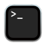

# Troubleshooting / Frequently Asked Questions

These are common questions, roughly by the order we encounter them during the semester.

## 1 Questions regarding the environment

### 1.1 How can I set up my environment (conda, shell, git)?

__Anaconda__: If you didn't install during orientation, go [here](https://www.anaconda.com/download/success), check the left side of the page on "Distribution Installers", and download the installer for your system.

__Shell__: On macOS, a shell is already installed: open the Spolight (Command-Space), type `Terminal.app`, and click on the icon with a black monitor. Then, go to the Dock, right-click on the same icon to bring a pop-up menu, click on `Options`, then on `Keep in dock`. The shell is now permanently in your Dock. The terminal icon looks like this:



On Windows, you have to install "git bash". Follow directions from the [Windows guide](windows.md). The git bash icon looks like this:


__git__: On macOS, in a shell, type `git`. You should see something like `Install command-line tools?`. Say yes to everything. If you don't want to install command-line tools and XCode, follow the directions from the [macOS guide](macOS.md).

On Windows, git already comes with `git bash`.

### 1.2 Where can I find Anaconda/shell/git?

__Anaconda__: You can find Anaconda as a program on your computer. On macOS, open the Spotlight (Command-Space). On Windows, press the Start/Windows key. On both systems, type `Anaconda` and click on the icon that looks like a green circle:


__shell__: On macOS, either open the Spotlight (Command-space), type "Terminal", and click on the black monitor icon; or click on the black monitor icon that should now be in your Dock (at the bottom, left or right of your computer). On Windows, either press the Start/Windows key, type "git bash", and click on the four-colored icon; or click on the four-colored icon in the task bar:


__git__: git is a "command-line only" program and does not have a graphical user interface. You can only access it through the shell.


## 2 Questions regarding Bash / shell

### 2.1 Why does this command not work as in the slides (e.g., some `b9-` command)?

There could be several reasons.

#### 2.1.1 not using a Bash shell

- __You are in Python Interactive Mode__: if you see a `SyntaxError`, you are trying to run a shell as a Python command. The two are different. Exit the interactive mode by either (1) typing `exit()` and pressing ENTER, (2) hitting Control-D on macOS or Control-Z on Windows. Then run the command again.

- __You are on Windows and are using a shell other than git bash__: Unfortunately, Windows has many shells, which are confusing. Check the top of the program to see the name of the shell. If it's not "git bash", or doesn't have this icon, you need to start git bash and run commands there:


#### 2.1.2 not at the right location

- __You are not at the right location__: If you see an error `file not found`, you are not at the right location. Use `pwd` (print working directory) to check where you are in the computer. Use `ls` to list the files at the current location. Use `cd` (change directory) to navigate to the right location, then try again.

#### 2.1.3 not the right bash syntax

- __You are running a Python command__: Python commands don't work in Bash, for example `a_list = [1, 2, 3]` is valid in Python but not in the shell.

- __You copied the prompt ($ or %)__: I add the prompt, `$` or `%`, to distinguish what is an input to the shell and what is an output, or to emphasize that a command is for the shell and not for Python. Remove the prompt at the start of the line and run again.

- __You copied a file but not the program__: A command in Bash/shell always calls a program first (such as `git`, `cd`, `python`) and then arguments (such as a filename). You may have accidentally copied a filename without the program.

- __Your command does not have the right spaces__: spaces are important for shell commands. Spaces separate the command and its arguments, and they separate arguments. In this course, we usually pass at most 1 argument, so in most cases, you should have only one space in the whole line.

For example, if you type this:

``` bash
b9-doctestsexercise_1_delivery.py
```

You will see an error `command not found:`. Bash is looking for a program starting with that exact name and cannot find one. The issue is a space missing between `b9-doctests`, the program, and `exercise_1_delivery.py`, the argument. So the correct command is:

``` bash
b9-doctests exercise_1_delivery.py
```

In other cases, you have too many spaces, for example:

``` bash
git clone https: // github . com / mm3509 / b9122
```

In this case, you get the error message: `fatal: Too many arguments.` The program `git` receives the first argument, `clone`, and expects only one other argument, the webpage or URL to get code from. Since Bash uses spaces to separate arguments, it looks like you pass multiple arguments, and thus the command throws an error. The right command in this case has no spaces in the URL:

``` bash
git clone https://github.com/mm3509/b9122
```

#### 2.1.4 not using my code

- __You did not hook your shell to my code__: If you see an error `command not found` and it's not a problem of spaces, most likely you In the file `b9.sh` in our repository, I provide helpful commands and shortcuts that will be useful during the course. For example, instead of submitting on Gradescope to see if your code passes doc-tests and style, you can those checks "locally" (i.e., on your computer) and avoid "burning" one of your three submissions a day. See below how you can hook your shell to my code

### 2.2 What’s current working path / Where am I?

The shell is always at a certain location of your computer. You can get this location by running the command `pwd`, for example:

```
$ pwd
/Users/miguel
```

The `cd` command changes directories. For example, to change into our directory, you would run:

``` bash
cd; cd b9122
```

## 3 Questions regarding Python

### 3.1 How can I edit the code?

First, you navigate to the location of the file (using Finder on macOS and Windows Explorer on Windows). Then, double-click the file you want to edit. It should open in your default text editor. If not, go back to the file, right-click, click on `Open with`, then on `Other`, and choose your text editor. Before pressing ENTER, click a box that says something like `Always open with`.

Then, you can start writing code at the places marked with `# TODO`.

You should NOT write code in Python Interactive Mode, because you cannot save that to a file on your computer. Only use Python Interactive Mode to test short pieces of code.

### 3.2 How can I run the code? Which app should I use for running the code?

You should use a shell (Terminal.app or git bash) to run code.

Launch the shell, navigate to the location of the file you want to run (using `cd` and `pwd` to confirm), then run this command in the shell:

``` bash
python <name-of-file.py>
```

For example, to run the code of the template file of exercise 1 in assignment 1, you would run these commands:

```
cd; cd b9122/3-assignments/assignment-1;
python exercise_1_exchange.py
```

### 3.3 Should I write code before or after the docstring?

After.

A doc-string is a triple-quoted string right after the function definition. If you write code before the doc-string, then it's no longer a doc-string and doc-tests will not be recognized.

I help you on this by marking with `# TODO` the places where you should write code.

### 3.4 I keep getting the same error, why?

Your text editor may not save your file automatically. This is usually indicated by a change in the filename at the top of the window (in bold, with a star, with some other icon). First save the file, then run the file again from the shell.

## 4 Questions regarding errors

### 4.1 What should I do when an error occurs?

Errors are a big part of programming. You may worry that you did something wrong, but it's perfectly normal at your stage and all errors can be fixed. An error is an opportunity to learn something new and to improve as a programmer.

### 4.2 What does this error mean?

First, read the error carefully. An error almost always has a human-readable message, even if it looks cryptic. For example, one error above was too many spaces, which is what the shell means by `too many arguments`. Another error was `command not found`, because the command was missing a space and the long command indeed did not exist.

If you cannot find the solution, please follow the next step in the checklist.

### 4.3 I cannot solve the problem, could you help?

Yes, of course! Please raise your hand and a TA or I will help you. If outside of class, please ask in Canvas Discussions or come to Office Hours.


Here is a checklist for solving errors:

TBA


, you first need to download my code onto your computer. `git clone` is the command for tha
## 5 Other questions

### 5.1 How can I debug in PyCharm?

Please watch [this video](https://www.youtube.com/watch?v=sRGpvbhOhQs).
